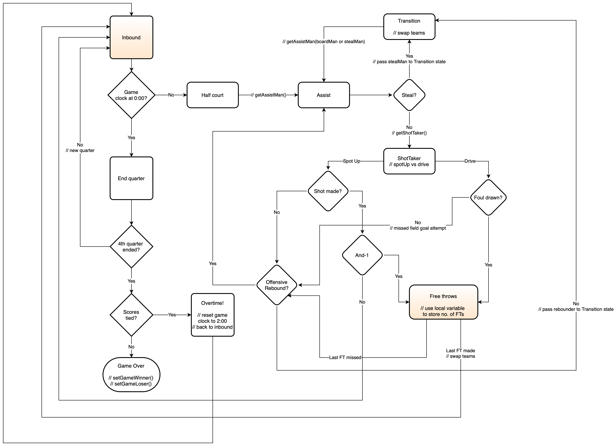

# Make or Miss - Basketball Simulation

This simulation provides a detailed basketball game engine with events logging, team management, and player interactions. The project is designed to simulate basketball games and record detailed event data for later visualization and analysis.

## Project Structure

The repository is organized into several directories:

- `player/`: Manages player attributes, ratings, and statistics.
- `team/`: Includes team-related functionality and data.
- `game/`: Contains the core game engine, event logging, game state management, and related utilities.
- `util/`: Contains utility modules for various project aspects, including data loading functions.
- `data/`: Stores team and generated game data and simulation results.

## Key Components

### Game Engine

The `game/` directory houses the game engine responsible for simulating basketball matches. Key features include:
- Event-driven game flow (tip-off, possessions, shots, rebounds, free throws, etc.)
- Player selection based on skills and ratings
- Game state management (clock, score, quarter tracking)
- Comprehensive event logging for game playback and analysis

### State Machine Diagram

### Event Logging System

The simulation implements a hybrid event logging approach:
- Records detailed events during game simulation (shots, rebounds, fouls, etc.)
- Creates checkpoints at strategic times (quarter boundaries) to store complete game state
- Outputs structured JSON data for frontend visualization

### Team Management

The `team/` directory contains modules to manage team data, including:
- Team compositions and lineups
- Team statistics tracking
- Utility functions for team operations

### Player Attributes

The `player/` directory manages player-related functionalities, including:
- Player attributes and ratings
- Performance statistics tracking
- Skill-based selection mechanics for game actions

### Data Organization

Team data is stored in CSV format in the `data/teams/` directory:
- Each team has its own CSV file with player attributes
- The simulation can load any team from this directory
- CSV files follow a standard format with player attributes, ratings, and positions

## Getting Started

To get started with the simulation, follow these steps:

1. Clone the repository: `git clone https://github.com/okonma01/make-or-miss.git`
2. Install the required dependencies: `pip install -r requirements.txt`
3. Run the simulation: `python main.py`

The simulation will load team data from `data/teams` and generate a complete game simulation with detailed event logs saved as JSON. The game file will be saved in the `data/games` directory.

## Current Development

The project is currently focused on:
1. Refining the game simulation engine
2. Improving the frontend visualization of game simulations
3. Deploying the simulation as a web application for public access

## Credits

This project was developed by Okonma and GitHub Copilot.

## License

This project is licensed under the [MIT License](LICENSE).